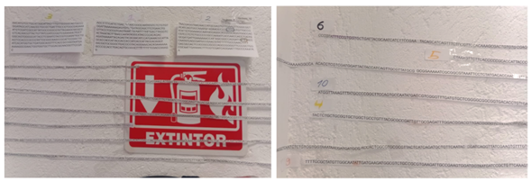

## Metodología
*Simulación de secuenciación*

Los genes fueron recortados individualmente y se nombraron del 1-10. Una vez acomodados de manera lineal y pegados a la pared con cinta, se buscó cada lectura corta y larga dentro de estos genes. La búsqueda se realizó de uno en uno y se mantuvo un registro de las veces en las que cada secuencia apareció y en qué genes de acuerdo con el número de gen asignado.  Si bien algunas lecturas fueron identificadas manualmente, otras se encontraron directamente en el archivo mediante el uso de la herramienta de búsqueda en el documento pdf. 




##Resultados


```{r, echo=FALSE}


```

##Discusión 

